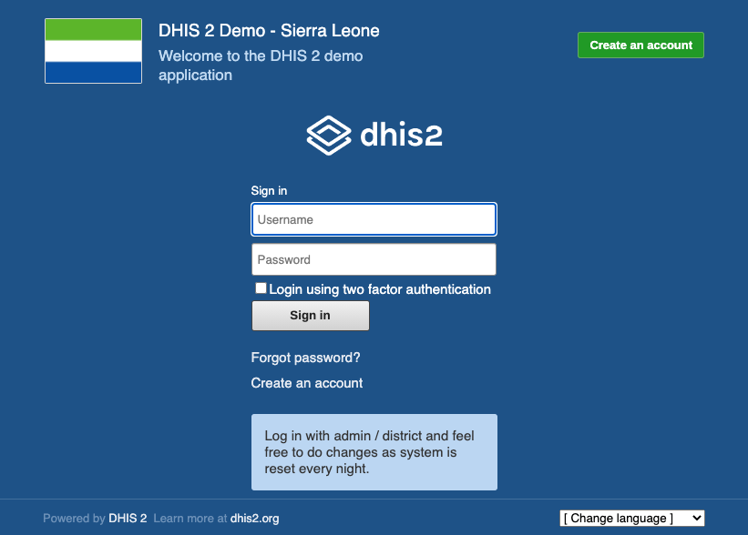
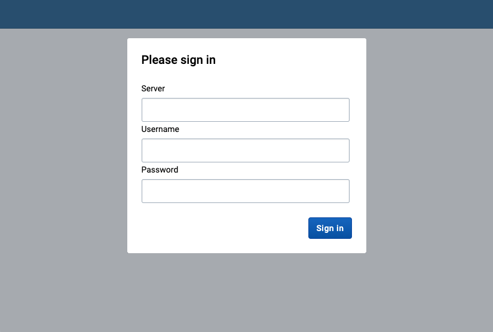
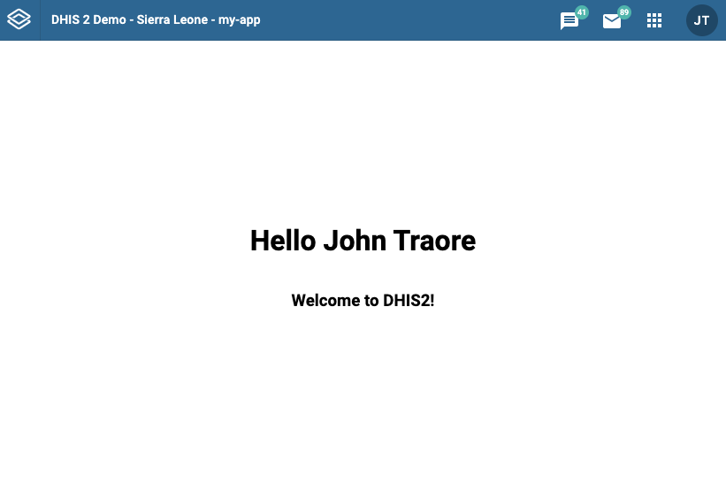

# Quickstart for DHIS2 App Development

## Create a new app and connect it to a local DHIS2 instance in 10 minutes or less.

### Introduction
You can start developing a DHIS2 app on Mac, Windows or Linux using Docker and the DHIS command line interface (CLI). In this guide, you will install the prerequisites, start up a local DHIS2 instance and create a new app. Your app will connect to the local DHIS2 instance.

### Installing prerequisites
1. Download and install [Docker](https://docs.docker.com/get-docker/)
2. If you're using Linux, install [Docker Compose](https://docs.docker.com/compose/install/#install-compose-on-linux-systems)
3. Install [yarn](https://classic.yarnpkg.com/en/docs/install)
4. From the terminal, install DHIS CLI
```
yarn global add @dhis/cli
```

### Starting a local DHIS2 instance

1. From the terminal, start up DHIS2 and seed the database
```
d2 cluster up 2.35.0 --db-version 2.35 --seed
```
2. From the browser, navigate to http://localhost:8080. If DHIS2 is running you should see the following page,


### Creating a new app
1. From the terminal, create a new DHIS2 app called "my-app"
```
d2 app scripts init my-app
```
2. Change directories to `/my-app` and start the app
```
cd my-app && yarn start
```

### Connecting your app to DHIS2
1. From the browser, navigate to http://localhost:3000. You will see the following page

2. Enter the DHIS2 server url and the default admin user
```
server: http://localhost:8080
username: admin
password: district
```
3. You will see the default admin user name and a welcome message


### Next steps
- ... get some data?
- ... create a new user? 
